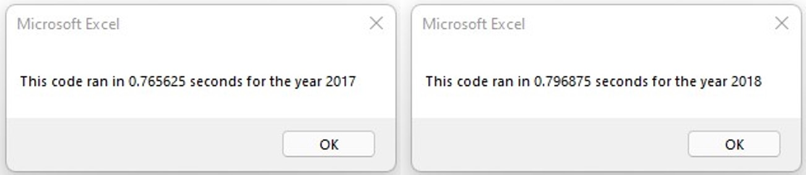
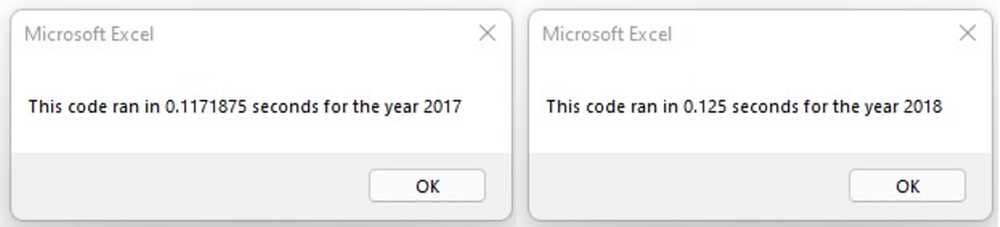
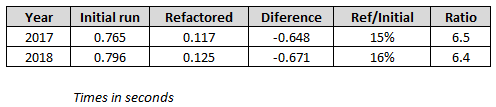

# Stock Analysis (Challenge 2)

---

## Project Overview

The purpose of this exercise is to "Refactor" the Stocks Analysis' code using Excel's VBA capabilities. The intention is not to change any process, but to optimize the way the calculations are done, thus reducing the computing time.

In this case, instead of looping **"12 times"** over the entire table to get data for all the Tickers (one at the time), an array will gather and store the required information in one iteration.

These are the computing times before refactoring:

* Should we expect to compute this routine in 1/12 (approximately 8%) of the initial time?

## Results

### a) Original Code Structure

> * Twelve stocks are being analyzed, initially, **for each stock**, a full search is performed through the entire spreadsheet. So in total, the entire data is read 12 times (actually only column "A" is read 12 times, not the entire spreadsheet).

### b) Refactoring Approach

> * By setting up an array (controlled by a Ticker Index), every time a new ticker is detected, the information for the previous ticker is stored, and the new ticker's information is analyzed/stored as needed. By doing this, the data is read just one time!

> After refactoring, the computing times are as follows:

> 

### c) Comparison

Once refactored, the runtimes improved (reduced) as expected, but not to 8% of the initial time. The following table shows that the new times are **15% and 16% of the initial times**. Huge improvement.

## Summary

* Advantages and Disadvantages of Refactoring Code in General

> The advantage of refactoring is definitely the reduction of computing time. It may not be appreciated in this particular example, but as databases get larger and calculations more complex, this will be noticable.

> A disadvantage is that some blocks/sections are being re-written, if the design concept is not fully and correctly understood, it may become a frustrating task.

* Advantages and Disadvantages of the Original and Refactored VBA Script

> An advantage of the refactored script is that, if properly planned, it will be simpler (less steps and iterations) compared with the original script. A clear advantage of the initial script is that it is already working!

> A disadvantage of the refactored script is that because it is being re-written, you can easily have mistakes or leave command lines intended to be removed.

### Comment

For this setup to work, the data must be sorted **by Ticker**, and then **by date** (ascending for the latter). This allows to read all the 12 tickers, and to properly compute the Returns of each one.